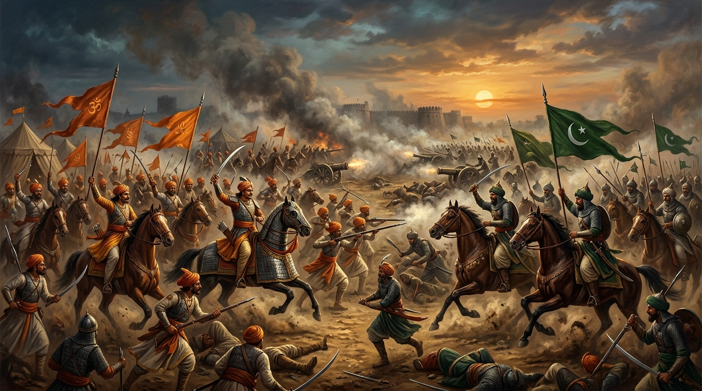

<div align="center">
  

  # ⚔️ PANIPAT: 1761
  ## *Shattered Dreams — A Cinematic Skeuomorphic Grand Strategy Simulation*

  [](https://react.dev/)
  [](https://vite.dev/)
  [](https://tailwindcss.com/)
  [](https://www.typescriptlang.org/)
  [](https://ai.google.dev/)
  [](LICENSE)

  ---

  ### 🔗 [Launch the Imperial War Room](https://ai.studio/apps/f5c2ea15-78ef-4703-8a66-ec69c9008ac0)

  *Step onto the dusty, blood-soaked plains of 18th-century Hindusthan. Command massive empires, navigate crippling winter supply chains, orchestrate high-stakes diplomacy, and fire heavy brass artillery in real time.*
</div>

---

## 📜 Historical Prologue

> "The two main pearls have been dissolved, twenty-seven gold mohurs have been lost, and of the silver and copper, the total cannot be cast up..." 
> — *The cryptic intercepted Maratha letter following the catastrophe at Panipat.*

In the harsh winter of **1761**, the destiny of the Indian subcontinent was decided on the battlefields of Panipat. 

On one side stood the formidable **Maratha Confederacy**, whose sovereign standard flew from the Deccan cliffs to the Indus River, seeking to unify Hindusthan under a centralized, secular throne. On the other marched the **Durrani Empire**, a titanic Afghan coalition under the strategic mastermind **Ahmad Shah Durrani (Abdali)**, supported by Rohilla and Awadh allies. 

**Panipat: 1761 — Shattered Dreams** is an immersive strategy game and interactive visual chronicle that places you at the epicenter of this monumental historical event. Using highly stylized skeuomorphic parchment interfaces, dynamic map visualization, and real-time tactical troop management, players navigate the political negotiations, economic supply strain, and brutal combat maneuvers that shaped modern history.

---

## 🏛️ Core Gameplay Pillars

The simulation transitions fluidly between grand strategic planning, local economics, visual-novel debates, and intense battlefield actions:

### 🗺️ 1. The Grand Campaign Map
Embark on an 8-stage historical campaign tracing the army's march from Pune to northern India:
*   **Stage I: Nizam Campaign (Battle of Udgir)** — Defeat the Nizam of Hyderabad and secure vital gold reserves.
*   **Stage II: Pune Assembly** — Rally the elite Huzurat Cavalry and French-discipline Gardi Infantry.
*   **Stage III: Burhanpur Crossing** — Negotiate treacherous river banks and supply lines.
*   **Stage IV: Gwalior Fort** — Secure alliances with regional chiefs and organize troop logistics.
*   **Stage V: Delhi Negotiations** — Engage in diplomatic discussions with Northern allies.
*   **Stage VI: Shinde’s Stand** — Hold the line against overwhelming Afghan forces at the Yamuna.
*   **Stage VII: Battle of Delhi** — Breach the Red Citadel and claim the Mughal treasury.
*   **Stage VIII: Final Stand at Panipat** — Combat starvation, blockades, and resolve the ultimate battle.

### ⚔️ 2. High-Fidelity Battle Canvas & Tactics Engine
Take direct command of battlefields using an interactive military canvas:
*   **Troop Deployment**: Arrange heavy **Gardi Musketeers**, swift **Mawala Raiders**, deadly **Afghan Rohillas**, and massive **Camel-mounted Zamburak swarms** on a tactical field grid.
*   **First-Person Artillery Blast**: Click anywhere on the open ground during real-time combat to fire heavy field brass cannons manually! Experience realistic weapon recoil animations, screenshake feedback, smoke plumes, flash flares, and high-impact ground explosions to shatter defensive infantry lines.
*   **Unit Modifiers**: Dynamically adjust unit status, monitor stamina depletion, command melee retreats, and track ammunitions during live skirmishes.

### 💰 3. Logistics Tycoon & Sovereign Web3 Ledger
*   **Treasury Ledger**: Command campaign finances measured in **Gold Mohurs**. Reinforce supply columns, purchase munitions, and distribute rations to camp followers.
*   **MetaMask Integration**: Connect your decentralized Web3 wallet to align your sovereign treasury. Connecting a valid decentralized account automatically awards a campaign-starter bounty of **+50,000 Gold Mohurs** from the Central Treasury. A robust local fallback sandbox is provided for players without Web3 extensions.

### 👥 4. Diplomacy Darbar & Visual-Novel AI Council
*   **Diplomatic Alignments**: Balance your relations (Allied, Wary, Neutral, Hostile) and Faction Trust with North-Indian powers like Nawab Shuja-ud-Daula of Awadh and Najib-ud-Daula.
*   **AI War Council**: Witness heated strategic debates inside the commander's tent between historical generals (**Sadashivrao Bhau**, **Malharrao Holkar**, **Ibrahim Khan Gardi**). Side with a commander to enforce instant troop adjustments and alignment shifts.

---

## 🎓 Shaniwar Wada Seminary (Student LMS) — *COMING SOON!*

<div align="center">
<div style="background-color: #12100e; border: 2px solid #D97706; padding: 24px; border-radius: 8px; margin: 20px 0; max-width: 90%; text-align: left;">
<h3 style="color: #F59E0B; margin-top: 0; font-family: 'Georgia', serif; letter-spacing: 0.05em; text-transform: uppercase;">🎓 The Academy Hub & Student LMS</h3>
<p style="color: #d1d5db; font-size: 14px; line-height: 1.6;">
Prepare to step inside the hallowed, basalt-hewn chambers of the <strong>Shaniwar Wada Seminary</strong>. Designed for educators, historians, and students alike, this upcoming <strong>Learning Management System (LMS)</strong> is a state-of-the-art academic center wrapped in a beautiful, skeuomorphic, royal parchment aesthetic. It bridges interactive historical gameplay with academic curricula to deliver a learning experience like no other.
</p>

<h4 style="color: #F59E0B; font-size: 13px; text-transform: uppercase; margin-bottom: 8px;">✨ Key Academy Features Included in the Syllabus:</h4>
<ul style="color: #9ca3af; font-size: 13px; line-height: 1.5; padding-left: 20px; margin-bottom: 16px;">
<li>📖 <strong>Dual-Pathway Interactive Syllabus</strong>: Ten masterclasses split across <em>Student</em> (core history & military strategies) and <em>Scholar</em> (deep geopolitical studies, archival letters) tracks, with local persistent learning states.</li>
<li>🕸️ <strong>D3.js Force-Directed Knowledge Network</strong>: A magnificent, mathematically modeled dynamic constellation connecting historical commanders, strategic treaties, and military maneuvers. Click to focus nodes and uncover raw biographies.</li>
<li>♟️ <strong>Formations Playbook Sandbox</strong>: A physical playground sandbox. Configure active weather conditions (Sunny, Winter Frost, Choking Dust Storms) and deploy elite historical brigades to instantly simulate military strength, army cohesion, and flanking advantages.</li>
<li>⚖️ <strong>Unified Decision Chronicles</strong>: Confront 5 major, non-linear historical forks (such as the Yamuna river crossings and bullion treasury liquidations). Analyze your tactical alignment through real-time telemetry diagnostics (Guerrilla Vanguard vs. Consolidated Imperialist).</li>
<li>📜 <strong>Authentic Manuscript Archives</strong>: Unroll and review detailed English translations of actual 18th-century diplomatic scrolls, intercepted letters, and sacred peace treaties.</li>
<li>🏆 <strong>Dynamic Certification Exams</strong>: Test your historical knowledge with randomized challenge questions pulled from an onboard academic warehouse to earn a printable, customizable <strong>Royal Seminary Diploma</strong> bearing the Grand Peshwa Seal.</li>
</ul>

<div style="border-top: 1px solid #2d261e; padding-top: 12px; font-size: 12px; color: #F59E0B; text-align: center; font-weight: bold; letter-spacing: 0.1em; text-transform: uppercase;">
🛡️ Transforming History from a Static Text into an Active, Tactical Playground
</div>
</div>
</div>

---

## 🤖 Gemini AI Integration: Your Tactical Companion

The game harnesses the advanced power of the **Google Gemini SDK** (`@google/genai`) to elevate roleplaying immersion:
1.  **Direct-to-Commander War Council**: Engage in strategic consultations with virtual representations of 18th-century generals. The AI model analyzes your active resources, gold, provisions, and current campaign stage, responding in-character with advice shaped by their historical counterparts.
2.  **Intel Scroll Generator**: Gemini dynamically compiles personalized battlefield intelligence scrolls, decrypted letters, and political briefings based on your unique choices and faction alignments.

---

## 📂 Codebase Architecture & System Design

"Panipat: 1761" is engineered on a highly optimized, decoupled full-stack architecture that blends high-performance client-side simulation with server-authorized operations. The design values strict separation of concerns, mathematical game loops, and skeuomorphic visual consistency.

```
┌────────────────────────────────────────────────────────────────────────────┐
│                             IMPERIAL USER ROOM                             │
│                      (Tailwind v4.0 + Motion React)                        │
└──────────────────────┬──────────────────────────────┬──────────────────────┘
                       │                              │
                       ▼                              ▼
┌──────────────────────────────────────────┐    ┌────────────────────────────┐
│          REAL-TIME GRAPHICS              │    │     SKEUOMORPHIC HUD       │
│      (HTML5 Canvas/Artillery Blast)      │    │  (State-driven Parchments) │
└──────────────────────┬───────────────────┘    └─────────────┬──────────────┘
                       │                                      │
                       ▼                                      ▼
┌────────────────────────────────────────────────────────────────────────────┐
│                            STATE ORCHESTRATION                             │
│              (Campaign Engine / React Context / Event Bus)                 │
└──────────────────────┬──────────────────────────────┬──────────────────────┘
                       │                              │
                       ▼                              ▼
┌──────────────────────────────────────────┐    ┌────────────────────────────┐
│          SEMINARY LMS STORE              │    │    SOVEREIGN TREASURY      │
│      (D3 Force-Directed Syllabus)        │    │    (MetaMask Web3 / API)   │
└──────────────────────────────────────────┘    └─────────────┬──────────────┘
                                                              │
                                            Express API Proxy │ JSON Requests
                                                              ▼
┌────────────────────────────────────────────────────────────────────────────┐
│                         STANDALONE EXPRESS BACKEND                         │
│                    (Vite middleware / Safe Git Portal)                      │
└────────────────────────────────────────────────────────────────────────────┘
```

### 🏛️ Architectural Subsystems

#### 1. Real-Time Tactile Combat & Artilleries Canvas
*   **Grid Coordinate Mapping**: Built on a modular 2D coordinate space container mapping physical layout matrices. 
*   **Artillery Particle Recoil System**: Features custom dynamic velocity physics for ballistic calculations, screenshake displacement algorithms, particle fade-ins, and high-impact ground explosions. 
*   **Action Tick Loops**: Combines custom state handlers with delta-timing to update unit stamina, combat multipliers, ammunition, and target engagement without bottlenecking UI threads.

#### 2. Shaniwar Wada Academy (LMS) State Machine
*   **Relational Event Bus**: Implements a dedicated asynchronous, non-blocking `LMSEventBus` to broker milestones and events between the **Syllabus Progress Tracker**, **Knowledge Network Canvas**, and the **Playbook Sandbox**.
*   **D3 Force-Directed Engine**: Renders historical actors, treaties, and routes dynamically. Resolves structural collisions via multi-body simulation physics to distribute labels beautifully.
*   **Learner Persistence Layer**: Uses a unified localized store to save syllabus completion, challenge exam records, and non-linear strategic alignments across sessions.

#### 3. Sovereign Ledger and Wallet Protocols
*   **Dual-path Treasury Architecture**: Adapts dynamically to user environment constraints.
    *   *Sovereign Web3 Mode*: Interfaces directly with modern browser-injected wallets (such as MetaMask) to log on-chain authentication and secure campaign-starter rewards.
    *   *Skeuomorphic Sandbox Mode*: Seamlessly falls back to local mathematical state tracking, allowing deep ledger allocations without blocking gameplay.

#### 4. Express Secure Server & Git Portal
*   **Vite Dev Pipeline**: Dual-mode bootstrapping utilizing a single Express instance. Mounts hot Vite development middleware in non-production, while executing optimized compiled bundles via static file delivery pipelines in production.
*   **Secure API proxy**: Eliminates API keys from client-side vulnerability surfaces by routing sensitive requests (such as the Gemini API and remote repo sync operations) through protected server-side controller pathways.

---

## 📂 Detailed Directory Map

```
panipat-1761-shattered-dreams/
├── public/                      # Static assets and cartography maps
│   ├── afghan_map.png           # Cartographic Afghan logistical pathways
│   ├── historical_map.png       # Cartographic Maratha campaign routes
│   ├── maratha_faction_logo.png # Saffron Maratha Empire sigil
│   ├── durrani_faction_logo.png # Afghan Durrani Empire sigil
│   └── readme_banner.jpg        # Cinematic header banner
├── src/
│   ├── components/              # Isolated game engine widgets & tactical mini-games
│   │   ├── AIDebateRoom.tsx     # Visual novel-style general debates & councils
│   │   ├── MultiplayerLobbySimulator.tsx # Simulated matchmaking arena and card battles
│   │   ├── ArtilleryCalibration.tsx # Windage & powder ratio mathematical cannon game
│   │   ├── BattleCanvas.tsx     # Real-time deployment rendering and unit grids
│   │   ├── CampSupplyTycoon.tsx # Provisions, rations, and caravan tracking system
│   │   ├── CavalryChargeSimulator.tsx # Formations, angle of attack, and momentum math
│   │   ├── DiplomacyDarbar.tsx  # Dynamic trust adjustments and treaties
│   │   ├── SwordDuelArena.tsx   # Hand-to-hand commander parry & strike duels
│   │   ├── PuneCelebrationVisual.tsx # Shaniwar Wada celebration visualizer with fireworks
│   │   ├── GlobalOverlays.tsx   # Help scrolls, audio panels, and Git remote sync
│   │   ├── SharedUI.tsx         # Skeuomorphic parchment controls
│   │   └── FeedbackWidget.tsx   # Inline player review module
│   ├── screens/                 # Fullscreen game states and primary dashboards
│   │   ├── MainMenu.tsx         # Cinematic introduction, faction and hero selection
│   │   ├── StrategicMap.tsx     # Campaign map traversal and stage narrative logs
│   │   ├── TacticalHUD.tsx      # Sandbox configurations & battle selectors
│   │   ├── WarCouncil.tsx       # AI debate logs, council room and alignment indicators
│   │   ├── Logistics.tsx        # Comprehensive ledger of provisions and attrition
│   │   ├── Treasury.tsx         # Sovereign gold allocation and Web3 wallet integration
│   │   ├── Encyclopedia.tsx     # Exhaustive historical database and biographies
│   │   ├── Timeline.tsx         # Historical chronology of major milestones (1758-1761)
│   │   ├── BattleScene.tsx      # Battle execution coordinator
│   │   ├── Cartography.tsx      # Dynamic cartographic overlay visualization
│   │   ├── LMS.tsx              # Core Student Learning Management System layout
│   │   ├── LearningHub.tsx      # Comprehensive syllabus milestones and node tracks
│   │   └── Victory.tsx          # Win/Loss banners, statistics, and campaign wrap-ups
│   ├── lms/                     # Academy state coordinators
│   │   ├── LMSProvider.tsx      # Unified state provider
│   │   ├── LMSEventBus.tsx      # Cross-component event brokers
│   │   └── LearnerStore.ts      # Persistent academy storage engine
│   ├── utils/                   # General helper files
│   │   ├── audioSystem.ts       # Adaptive multi-scene background audio engine
│   │   ├── fuzzyWeather.ts      # Fuzzy-logic weather calculations for campaigns
│   │   └── historyData.ts       # Database for encyclopedia entries and stages
│   ├── App.tsx                  # Main screen state router and session coordinator
│   ├── main.tsx                 # React entry mount point
│   ├── index.css                # Base Tailwind styling & parchment card utility classes
│   ├── types.ts                 # Enums, Interfaces, and types
│   └── vite-env.d.ts            # Vite environment variables
├── index.html                   # HTML Entry point
├── server.ts                    # Full-stack Express server to handle API proxy & Git Sync
├── package.json                 # Dependency manifests
└── vite.config.ts               # Vite configuration (with integrated Tailwind)
```

---

## 🚀 Local Installation & Set-Up

Experience the simulation locally in your own development workspace.

### Prerequisites
*   [Node.js](https://nodejs.org/) (Version 18.x or newer)
*   [npm](https://www.npmjs.com/) or [yarn](https://yarnpkg.com/)

### 1. Clone & Prepare Environment
```bash
# Clone the repository
git clone https://github.com/pallasite99/panipat-1761-shattered-dreams.git
cd panipat-1761-shattered-dreams

# Install all standard dependencies
npm install
```

### 2. Configure Environment Secrets
Create a `.env` or `.env.local` file in the project's root folder and enter your credentials:
```env
# Google Gemini API key (Server-side exclusive - DO NOT expose with VITE_)
GEMINI_API_KEY=your_actual_google_gemini_api_key_here
```

### 3. Boot the Server
Run the full-stack development environment (Express + Vite Middleware proxying port `3000`):
```bash
npm run dev
```
Open **`http://localhost:3000`** inside your web browser to enter the campaign.

### 4. Build and Production Run
```bash
# Compile client assets and bundle Express backend
npm run build

# Start the optimized Node production server
npm run start
```

---

## 🛡️ License & Acknowledgements

*   **License**: Licensed under the Apache License, Version 2.0. See [LICENSE](LICENSE) for details.
*   **Aesthetics**: Custom wood-grain patterns, parchment vectors, and audio scoring curated specifically to maintain the epic weight of 18th-century Maratha-Afghan warfare.

---

<div align="center">
  <p style="font-size: 11px; color: #78716c; text-transform: uppercase; letter-spacing: 0.15em;">
    Made with passion for Military History, Interactive Learning, and Epic Gaming Experiences.
  </p>
  <p style="font-size: 14px; color: #F59E0B;">
    🚩 Hindusthan awaits your commands. Assemble the vanguard! 🚩
  </p>
</div>
