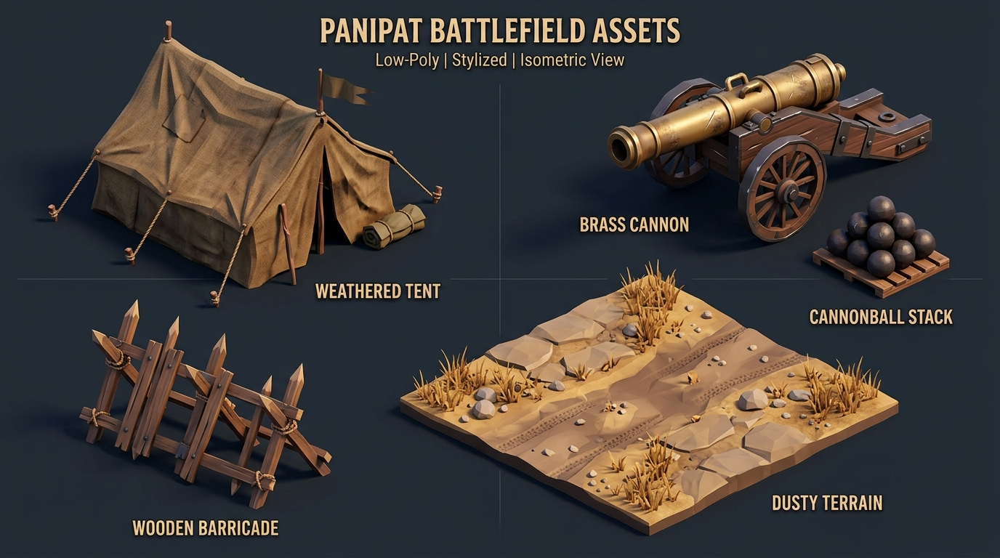

# Godot Engine Integration Architecture

This document outlines the architectural design and integration plan for embedding a custom-built, WebAssembly-compiled **Godot Engine (GLES3/WebGL 2.0)** instance into the React tactical battle simulator frontend. 

It details the multi-phase implementation roadmap, bidirectional communication protocols, and real-time rigid body/ballistic state synchronization.

---

## 1. Architectural Overview

The application utilizes a **hybrid dual-layer architecture**:
1. **React UI Layer (Controller & State Master)**: Manages high-level tactical state, battle phases, inventories, active rules, army morale, and overall player statistics.
2. **Godot WebGL Layer (Physics & 3D Renderer)**: Executes real-time 3D rendering, parabolic ballistics simulation, GLES3 rigid body collision detection, and autonomous unit pathfinding.

```
       +--------------------------------------------+
       |             React tactical App             |
       |  (State, Morale, Cohesion, User Controls)  |
       +-----+--------------------------------+------+
             |                                ^
             | dispatch packet                | incoming signal
             | (REACT_TO_GODOT)               | (GODOT_TO_REACT)
             v                                |
       +-----+--------------------------------+------+
       |       window.JavaScriptBridge Gateway      |
       +-----+--------------------------------+------+
             |                                ^
             | GLES3 / WebGL bindings         | WASM Bridge Callback
             v                                |
       +-----+--------------------------------+------+
       |           Godot WebAssembly Engine         |
       |    (3D Mesh, RigidBody3D Colliders,        |
       |     Pathfinding, Ballistics solver)        |
       +--------------------------------------------+
```

---

## 2. Three-Phase Implementation Roadmap

### Phase 1: Bootstrap & Bridge Diagnostics
- **Objectives**: Establish raw canvas rendering, WebAssembly module loading protocols, and basic lifecycle handshakes.
- **Components**:
  - **WebGL Viewport Hookup**: Compile GLES3 canvas contexts and configure WebGL error boundaries.
  - **Status Console**: Live monitoring of WebGL memory, GPU drivers, and pipeline telemetry (`WASM_ACTIVE` verification).
  - **Quality Adapters**: Dynamically throttle resolution scale (from `0.5x` to `1.5x`) and toggle shadow/shader features to preserve mobile frames.

### Phase 2: Dual-Directional Message Gateway
- **Objectives**: Enable structured JSON communication, virtual scene graph manipulation, and simulation overrides.
- **Components**:
  - **Packet Logger Engine**: Capture all serialized communication packets in high-performance circular buffers.
  - **Dynamic Scene Graph Appendages**: Append, select, or destroy custom unit mesh structures across factions (Maratha/Durrani).
  - **COOP Diagnostics**: Synchronized ping-pong latency metrics tracking JavaScript-to-WebAssembly crossing speeds (target `< 2ms`).

### Phase 3: Real-Time Physics Solver & Coordination
- **Objectives**: Enable interactive 3D rigid-body dragging, realistic paraboloid artillery ballistics, and autonomous melee walker engines.
- **Components**:
  - **3D Coordinate Rigging**: Translate mouse drag movements directly to coordinate manipulations inside the Godot coordinate spaces, syncing states instantly.
  - **Rigid-Body Collision Solver**: Implement `20Hz` proximity calculations mimicking physical rigid colliders. Exert equal and opposite separation vectors on intersecting entities, triggers damage ticks on overlap.
  - **Parabolic Projectile Simulator**: Fire physical projectiles following true Newtonian flight dynamics, calculating splash radius and splinter hits upon landing.
  - **Pathfinding Walkers**: Autonomous stateful walkers using target tracking to direct infantry and cavalry formations toward the nearest enemy colliders.

---

## 3. Communication Protocols

All communication between the React thread and the Godot instance is asynchronous and serialized as structured JSON payloads passing through `window.JavaScriptBridge`.

### 3.1 React to Godot (`REACT_TO_GODOT`)

These actions are dispatched from the React UI to control engine configurations or force tactical state updates inside the WebGL canvas.

#### A. Initialize Godot Viewport
```json
{
  "event": "initialize_godot",
  "payload": {
    "render_quality": "high",
    "resolution_scale": 1.0,
    "wireframe_mode": false,
    "weather": "foggy"
  }
}
```

#### B. Spawn Custom 3D Node
```json
{
  "event": "spawn_node",
  "payload": {
    "node_id": "custom_df93a",
    "label": "Gardi Musketeers",
    "faction": "maratha",
    "type": "infantry",
    "coordinates": [1.5, 0.0, -3.2]
  }
}
```

#### C. Real-Time Drag Coordinate Translation
```json
{
  "event": "translate_coordinates",
  "payload": {
    "node_id": "m1",
    "coordinates": ["1.45", "0.00", "-2.80"]
  }
}
```

#### D. Launch Ballistic Shell
```json
{
  "event": "launch_artillery_shell",
  "payload": {
    "origin_node": "m1",
    "target_node": "d1",
    "origin": [-4.5, 0.0, 3.2],
    "target": [2.5, 0.0, -1.8],
    "angle": 42,
    "initial_velocity": 24,
    "gravity": 9.8
  }
}
```

---

### 3.2 Godot to React (`GODOT_TO_REACT`)

Signals triggered inside the Godot simulation thread (e.g. physics colliders, timer timeouts, asset downloads) that alter the central game state in React.

#### A. Engine Initialization Handshake
```json
{
  "event": "engine_ready",
  "payload": {
    "gles_version": "3.0",
    "gpu_vendor": "WebKit WebGL",
    "total_heap_bytes": 134217728
  }
}
```

#### B. Dynamic Rigid-Body Collision Alert
```json
{
  "event": "collision_detected",
  "payload": {
    "entity_a": "m1",
    "entity_b": "d1",
    "impact_force": 12.5,
    "current_coordinates": {
      "m1": [-1.2, 0.0, 1.1],
      "d1": [-0.6, 0.0, 0.9]
    }
  }
}
```

#### C. Artillery Impact Splash Down
```json
{
  "event": "artillery_impact",
  "payload": {
    "impact_coordinates": ["2.48", "0.00", "-1.75"],
    "splash_radius": 3.2,
    "impacted_entities": [
      { "name": "Durrani Vanguard", "damage_taken": 31 },
      { "name": "Afghan Rohillas", "damage_taken": 14 }
    ],
    "primary_target_hit": true
  }
}
```

---

## 4. State Synchronization Guidelines

To prevent race conditions and floating point drifts across the JS/WASM barrier, state synchronization is governed by the following rules:

1. **Deterministic Authority**:
   - React owns tactical stats (e.g., army health pool, items left, current stage metrics).
   - Godot owns active space transformations (e.g., exact 3D velocities, collision overlaps).
2. **High-Frequency Coordinate Interpolation**:
   - Drag offsets are translated relative to the active Camera View Angle (rotated by the current `camYaw` and `camPitch`), ensuring dragging matches the visual mouse displacement.
3. **Double-Buffered State Mutation**:
   - On-drag state updates inside React are throttled to a safe frequency or deferred to mouse release events (`coordinate_placed`) to avoid memory leak build-ups on the React virtual DOM.
4. **Cohesion Reduction Triggers**:
   - Any physical clash event or ballistic explosion registered in the 3D WebGL renderer dispatches negative modifiers back to the main battle scene, instantly decrementing brigade cohesion levels and altering army morale.

---

## 5. 3D Environment Asset Guide

To guarantee stylistic cohesion across the 3D WebGL renderer and future custom Godot environments, a pre-compiled set of stylized low-poly placeholders has been established. This ensures both visual richness and GLES3 rendering performance on mobile browsers.

The generated isometric asset sheet serves as an official guidelines map for modeled objects:



### Asset Specifications & Optimization Guidelines:
- **Stylized Tents**: Modeled with coarse canvas shaders. To minimize draw calls, share a single `256x256` color palette texture across all modular tent designs. Keep vertex counts under `450` per tent.
- **Heavy Brass Artillery**: Low-poly pivot-aligned wheels to allow rotational adjustments on the X-axis for elevation. Bounding boxes must strictly fit within a `1.5m x 1.5m` collision circle.
- **Barricades & Wood Obstacles**: Modular wooden logs with pre-applied ambient occlusion maps. Ideal for establishing defensive choke-points on the tactical grid.
- **Dry Terrain Patches**: Reusable ground surface tiles styled with dusty sand-dune gradients and sparse parched weed meshes. Uses standard vertex-color shaders to avoid high-resolution fill-rate overhead.
